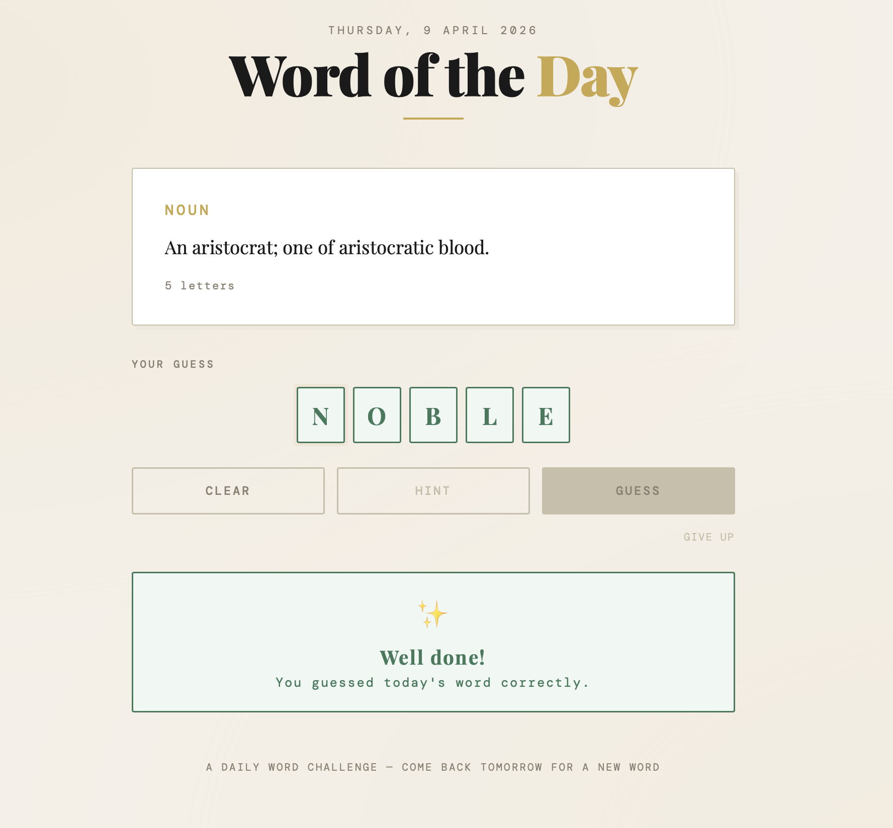

# Word of the Day — Frontend

A simple, elegant word guessing game powered by the [Word of the Day API](https://github.com/aleksandra-marszalek/word-of-the-day).

Every day a new word is fetched from an external API alongside with its definition. 
Users see the definition and part of speech, then guess the word by filling in the letter boxes (that show the length of the word). Correct guesses are remembered across page refreshes using localStorage.



## Live demo

You can now play the game [here](https://word-of-the-day-frontend.s3.eu-west-1.amazonaws.com/index.html)

---

## How it works

1. On load, the app calls `GET /api/v1/word/today` and displays the definition
2. User fills in the letter boxes (one character per box, keyboard input)
3. When all boxes are filled, the **Guess** button activates
4. Submitting calls `POST /api/v1/word/guess` with the user's guess
5. Correct → boxes turn green, success message shown, result saved to localStorage
6. Incorrect → boxes shake red, error message shown, user can try again via **Clear**

---

## Tech

- Vanilla HTML, CSS, JavaScript — no framework, no build step
- Playfair Display + DM Mono fonts via Google Fonts
- localStorage for persisting today's correct guess across page refreshes
- Single `index.html` file — open it directly in a browser or deploy anywhere

---

## Setup

Open `index.html` and update the API base URL near the top of the `<script>` tag:

```javascript
const API_BASE = 'https://YOUR_ID.execute-api.eu-west-1.amazonaws.com/Prod/api/v1/word';
```

Replace `YOUR_ID` with your API Gateway ID.

---

## Deploy to AWS S3

The simplest and cheapest hosting option. Costs fractions of a penny per month at this scale.

### 1. Create a bucket

```bash
aws s3 mb s3://word-of-the-day-frontend --region eu-west-1
```

### 2. Enable static website hosting

```bash
aws s3 website s3://word-of-the-day-frontend \
  --index-document index.html \
  --error-document index.html
```

### 3. Make it publicly accessible

```bash
aws s3api put-public-access-block \
  --bucket word-of-the-day-frontend \
  --public-access-block-configuration \
  "BlockPublicAcls=false,IgnorePublicAcls=false,BlockPublicPolicy=false,RestrictPublicBuckets=false"

aws s3api put-bucket-policy \
  --bucket word-of-the-day-frontend \
  --policy '{
    "Version": "2012-10-17",
    "Statement": [{
      "Sid": "PublicReadGetObject",
      "Effect": "Allow",
      "Principal": "*",
      "Action": "s3:GetObject",
      "Resource": "arn:aws:s3:::word-of-the-day-frontend/*"
    }]
  }'
```

### 4. Upload

```bash
aws s3 cp index.html s3://word-of-the-day-frontend/index.html \
  --content-type "text/html" \
  --region eu-west-1
```

### 5. Your URL

```
http://word-of-the-day-frontend.s3-website-eu-west-1.amazonaws.com
```

To update after changes, just re-run step 4.

---

## Optional: HTTPS via CloudFront

S3 static hosting serves over HTTP only. For HTTPS, put CloudFront in front:

```bash
aws cloudfront create-distribution \
  --origin-domain-name word-of-the-day-frontend.s3-website-eu-west-1.amazonaws.com \
  --default-root-object index.html
```

CloudFront provides a free SSL certificate and global edge caching.

---

## CORS

Your API needs to allow browser requests from your S3/CloudFront domain. Set these environment variables on your Lambda function in the AWS console:

| Key | Value |
|-----|-------|
| `MICRONAUT_SERVER_CORS_ENABLED` | `true` |
| `MICRONAUT_SERVER_CORS_CONFIGURATIONS_WEB_ALLOWED_ORIGINS` | `*` |
| `MICRONAUT_SERVER_CORS_CONFIGURATIONS_WEB_ALLOWED_METHODS` | `GET,POST,OPTIONS` |
| `MICRONAUT_SERVER_CORS_CONFIGURATIONS_WEB_ALLOWED_HEADERS` | `Content-Type,Accept` |

Also add `OPTIONS` events for both endpoints in your SAM template — the browser sends a preflight OPTIONS request before every POST.

---

## Related

- [Word of the Day API](https://github.com/aleksandra-marszalek/word-of-the-day) — the Micronaut backend powering this app
- [Blog post](https://www.aleksandramarszalek.co.uk/blog) — writeup of how the full stack was built
